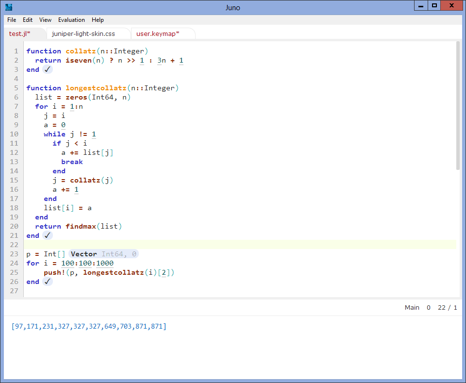

Juniper
=======
Provides two new skins and matching themes for Light Table.

The themes are optimized for [Julia](http://julialang.org), but can be used with any language.
If you are interested in an IDE for Julia, take a look at [Juno](http://junolab.org/docs/installing.html).

If there's anything annoying (especially with the light skin), please open an issue - I probably missed changing some part of LT somewhere.
=======
Based upon the [new-dark skin](https://github.com/LightTable/LightTable/blob/master/deploy/core/css/skins/new-dark.css).
